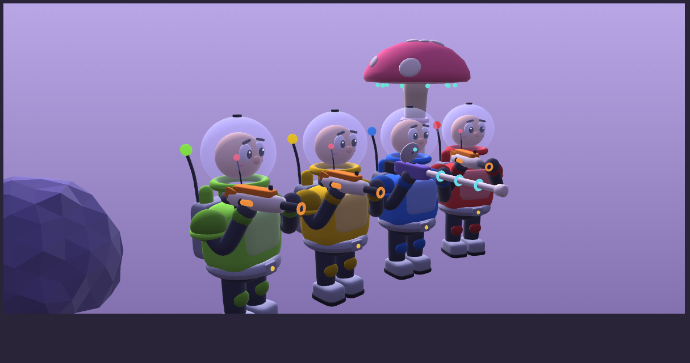

# Shooting-V2: Space Grunts

A Halo 2–style first-person arena shooter in Unity (C#), PC only, starring goofy cartoon space
marines who crash-landed on a weird little alien planet. The design lives in
[`docs/GDD.md`](docs/GDD.md).

## Current state: Phase 1 complete (gray-box), needs playtesting

Press Play and the **main menu** opens over a live bots-only match. Pick **Play vs Bots** to set up
a match (map, bots, difficulty, score/time limit) and drop into a **Free-for-All** on **Crash Site**:
a Midship-style alien-planet arena with 180° symmetry ([layout sketch](docs/maps/overlook-layout.svg)),
a center sniper platform, Red (north) and Blue (south) bases with tunnels and overlooks, and side ridges.

- **Bots** play on their own (no set paths): they roam, grab the sniper, hear gunfire, strafe,
  and fight you and each other, with human-like reaction time and aim. First to 25 kills or
  most kills after 10 minutes wins (both adjustable).
- **Weapons:** Pew Rifle (spawn weapon, 40 head / 25 body, 5 shots/s, 30 rounds) and Long Zapper,
  the sniper (center pad every 90 s, 100 head / 50 body, 2x scope, dropped on death).
- **Look:** goofy "Space Grunts" 3D models: bobble-head grunts in fishbowl helmets (helmets pop off
  in confetti), toy blasters, crashed dropships, giant mushrooms, lumpy alien rocks, a ringed planet
  in the sky, "pew" sounds.


- **Health:** 100 HP, regenerates after 5 s without damage.
- **HUD:** health + ammo panel bottom-left, kill feed, score, scoreboard, damage-direction arcs,
  red crosshair over enemies.
- **Controls:** keyboard + mouse or an **Xbox controller**, switchable at any time.
- **Crouch, grenades, rifle zoom:** hold crouch to duck behind cover (smaller hitbox, slower);
  start each life with 2 boom bombs and grab more from glowing pads on the map.
- **Graphics:** textured, normal-mapped rock/turf/hull plating, glossy armor, grass, clouds,
  bloom and filmic tone mapping. Settings → **Graphics quality** (Low / Medium / High).
- **Online:** host a game and invite Steam friends, or join a friend who's hosting (see below).
- **Menus:** main menu, match setup, settings (saved), controls, pause (Esc / Menu button).
  All usable with a controller.
- The **Test Range** map (pick it in match setup) has dummies at known distances and jump-test blocks.

## Opening the project

1. Install **Unity 6** (any 6000.x LTS) with Unity Hub.
2. Hub → **Add → Add project from disk** → pick this folder. If Hub asks about the editor
   version, choose the Unity 6 version you have installed.
3. Unity installs the **Input System** package on first open. If it asks to enable the new input
   backends and restart, click **Yes**.
4. Press **Play**. The main menu appears; choose **Play vs Bots → Start Match**.

**No input at all?** Edit → Project Settings → Player → Other Settings → **Active Input Handling**
must be **Input System Package (New)** or **Both** (not "Input Manager (Old)").

### Controls

| Action | Keyboard + mouse | Xbox controller |
|---|---|---|
| Move / look | WASD / mouse | Left stick / right stick |
| Jump | Space | A |
| Fire | Left mouse | RT |
| Zoom (Pew Rifle 1.5x) / scope (Long Zapper 2x) | Right mouse | Click right stick |
| Crouch (hold) | Left Ctrl or C | B or click left stick |
| Throw grenade | G | LT |
| Reload | R | X |
| Pick up weapon | E | Hold X |
| Switch weapon | Q, mouse wheel, 1, 2 | Y |
| Scoreboard | Tab (hold) | View (hold) |
| Pause menu | Esc | Menu |
| Hide controls hint | F1 | — |
| Hurt yourself (debug) | K | — |

Controller extras: rumble, a turn boost when holding the stick fully sideways, and light aim
assist (look slows while the crosshair is on an enemy). Tune them on `Player → PlayerInputReader`.

## Sharing the game with a friend

1. In Unity: **File → Build Profiles** (Unity 6), pick **Windows**, click **Build**, and choose an
   empty folder like `Builds/Windows`. (A `steam_appid.txt` is added next to the `.exe` automatically.)
2. Zip that whole folder and send it (Google Drive, Dropbox, Discord...). Your friend unzips it.
   Windows may show a SmartScreen warning for unknown apps: **More info → Run anyway**.
3. Optional: upload the zip to **itch.io** as a private or password-protected page, so friends
   always get the latest version from one link.

Both of you need the **same build** to play together online.

## Playing online with a friend (Steam invites)

Online play goes through Steam using Valve's free test app ID **480** ("Spacewar"), so the game
doesn't need a Steam store page. Steam will show you as "playing Spacewar": that's expected.

1. Both of you: have **Steam running and signed in**, and be Steam friends.
2. **Host:** Main menu → **Multiplayer → Host Game** → pick settings → **Start Hosting**.
   Then press **Esc / Menu** in the match → **Invite Friends** (Steam overlay) or **Invite From List**.
3. **Friend:** start the game first, then either accept the Steam invite (the game joins automatically)
   or go to **Multiplayer → Join a Friend** and pick the host.
4. Bots fill the empty slots (up to 8 grunts total); each friend who joins replaces a bot.

Notes: the host's game runs the match (bots, scores), so the host should have the better connection.
Online matches can't be paused (Esc opens the menu over the live match). **End Game for Everyone**
(host) or **Leave Game** (friend) is in that menu.

### Tuning

Numbers are serialized fields, so you can tweak them live in the Inspector during Play:
Match setup in the menu (bots, difficulty, score/time limit), Settings in the menu (sensitivity, FOV, aim assist...),
`Bot_* → BotController → Skill` (reaction, aim, vision), `Player → PlayerInputReader` (sensitivity,
deadzones, aim assist, rumble), `Player → PlayerMotor → Settings` (movement), `Player → Health` (regen),
`Player → WeaponHolder → Spawn Weapon` (rifle), `SniperPad → SniperSpawnPad` (sniper + timer).
Defaults are in `MovementSettings.cs` and `WeaponStats.cs`; update the GDD if you change them for good.

## Code layout

```
Assets/Scripts/Core/       Pure C# game rules (no UnityEngine): health/regen, weapon ammo/fire/reload,
                           2-slot loadout + pickup rules, spawn timer + spawn choice, FFA scoring,
                           bot skill/aim, stick response. Shared by player and bots.
Assets/Scripts/Core/Net/   Online protocol: message encoding, snapshots, interpolation, clock sync (tested).
Assets/Scripts/Gameplay/Net/  Steam layer (Steamworks.NET): lobbies/invites, P2P transport, NetSession.
Packages/com.rlabrecque.steamworks.net/  Steamworks.NET (MIT), vendored so nothing extra to install.
Assets/Scripts/Gameplay/   Unity components: motor, look, input (keyboard/mouse + gamepad), weapons/hitscan,
                           combatants, bots (BotController), match (MatchManager), HUD, bootstrap,
                           map builders (OutdoorArenaMap, TestRangeMap) and the outdoor look.
Assets/Tests/EditMode/     NUnit tests for Core (run in Unity's Test Runner or with dotnet, below).
Assets/Resources/Models/   3D models (.bytes) generated by Tools/ModelGen; loaded by ModelLibrary.
Tools/                     .NET check projects, and ModelGen (Python) which builds the 3D models.
```

## Checks without Unity

```sh
dotnet test  Tools/CoreTests           # game-rule unit tests
python3 Tools/ModelGen/generate.py     # rebuild the 3D models (needs numpy)
dotnet build Tools/UnityCompileCheck   # compiles all scripts against Unity reference assemblies
                                       # (+ Input System stubs mirroring the real package API)
```
